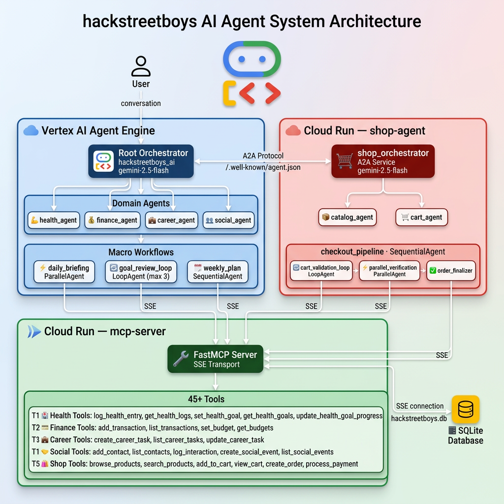

# HackstreetBoys AI — Prototype Submission Deck
### Gen AI Academy APAC Edition

---

## Slide 1 — Participant Details

**Participant Name:** HackstreetBoys

**Problem Statement:**
AI assistants today try to do everything with one agent — leading to hallucinations, poor context management, and unreliable results across complex multi-step tasks. There is no system where specialized AI agents handle their own domain expertly, collaborate seamlessly, and remember the user over time. Professionals and individuals manage their health, finances, career, social life, and shopping across dozens of disconnected apps — losing context, missing insights, and wasting time switching between tools with no unified intelligence.

---

## Slide 2 — Brief About the Idea

HackstreetBoys AI is a multi-agent personal life management system where **every boring, repetitive task gets its own expert agent**. Instead of one overloaded AI doing everything, we have 13 specialized agents — each an expert in its own small domain. The root orchestrator doesn't do the work, it just routes — reducing hallucination by never asking one agent to do too many things at once.

The A2A Shop Agent is our vision of the future: a world where **businesses run their own AI agents**, and your personal AI negotiates with them on your behalf — fully hands-off, no human intervention needed.

Built on **Google ADK**, deployed on **Vertex AI Agent Engine**, with **45+ tools** powered by the **Model Context Protocol (MCP)**.

---

## Slide 3 — Your Solution Should Explain

### How we approached the problem using ADK & MCP while meeting Hackathon requirements

We designed each agent to be a **narrow expert** — the health agent only knows health, the finance agent only knows finance. The root orchestrator's only job is routing. This directly reduces hallucination because no single agent is overloaded with unrelated context. MCP gives each agent only the tools it needs via `tool_filter` — scoped access, not a dumping ground.

### What real-world problem does this solve, and what practical impact does it create?

Users get **reliable, specialized responses** instead of one confused agent trying to juggle health, money, career, and shopping in the same context window. Each domain is handled by an agent that only thinks about that domain. One AI that manages your whole life — and actually remembers you.

### What is the core approach or workflow behind the solution?

```
User
  └── Root Orchestrator (routes only, never answers directly)
        ├── Health Agent      → Scoped MCP Tools → SQLite
        ├── Finance Agent     → Scoped MCP Tools → SQLite
        ├── Career Agent      → Scoped MCP Tools → SQLite
        ├── Social Agent      → Scoped MCP Tools → SQLite
        └── Shop Agent (A2A)
              └── Shop Orchestrator (Cloud Run)
                    ├── Catalog Agent  → MCP Tools
                    ├── Cart Agent     → MCP Tools
                    └── Checkout Pipeline
                          ├── Cart Validation Loop
                          ├── Parallel Stock + Payment Verification
                          └── Order Finalizer → MCP Tools
```

The agent that answers is always the right one for the job.

---

## Slide 4 — Opportunities

### How different is it from any of the other existing ideas?

Most AI products use a single agent or a simple chain. We deliberately split responsibilities so each agent stays **small, focused, and reliable**. The more specialized the agent, the less it hallucinates — because it only knows what it needs to know.

The A2A Shop Agent takes this further: it's not just a feature, it's a **glimpse into a future economy** where businesses deploy their own AI agents as storefronts. Your personal AI shops on your behalf, negotiates with the business agent, and completes the transaction — no human in the loop.

### USP of the Proposed Solution

| USP | Description |
|---|---|
| **Specialization over generalization** | 13 expert agents, each owning one small task |
| **Orchestrator as router, not doer** | Eliminates hallucination from context overload |
| **A2A as future business model** | AI-to-AI commerce — businesses run agents, users' AIs transact with them |
| **Persistent memory** | Vertex AI Agent Engine remembers user preferences across sessions |
| **Scoped MCP tools** | Each agent only sees the tools for its domain — less noise, less hallucination |

---

## Slide 5 — List of Features Offered by the Solution

- **13 Specialized Agents** — each an expert in exactly one domain, never asked to do too much
- **Intelligent Routing** — orchestrator delegates, never does — routing reduces hallucination
- **Health Agent** — fitness goals, meal planning, wellness tracking
- **Finance Agent** — budgets, expense logging, savings goals
- **Career Agent** — job search, skill tracking, interview prep
- **Social Agent** — relationship management, event reminders, gift suggestions
- **A2A Shop Agent** — an autonomous AI storefront: browse, cart, checkout — no human needed
- **Daily Briefing** — 5 specialist agents run in parallel, one unified summary across all domains
- **Weekly Planning** — sequential agent workflow planning across all 5 domains
- **Goal Review Loop** — iterative goal assessment with up to 3 refinement cycles
- **Persistent Memory** — Vertex AI Agent Engine remembers user preferences across sessions
- **45+ Scoped MCP Tools** — each agent only sees the tools relevant to its domain

---

## Slide 6 — Process Flow / Use-Case Diagram



### Normal Domain Request Flow

```
User Message
  → Root Orchestrator         (intent detection + routing)
  → Specialist Domain Agent   (expert in one domain only)
  → Scoped MCP Tools          (only tools for that domain)
  → SQLite Database           (persistent storage)
  → Response to User
```

### Shopping Flow — A2A (The Future of Commerce)

```
User: "Buy me a Latte and a Croissant"
  → Root Orchestrator         (detects shopping intent)
  → RemoteA2aAgent            (discovers Shop Agent via agent card)
  → Shop Orchestrator         (independent Cloud Run service)
  → Catalog Agent             (finds products via MCP)
  → Cart Agent                (adds items via MCP)
  → Checkout Pipeline
      ├── Cart Validation Loop        (verifies cart is valid)
      ├── Parallel Verification
      │     ├── Inventory Checker     (reserves stock via MCP)
      │     └── Payment Validator     (approves payment)
      └── Order Finalizer            (creates order + payment via MCP)
  → Order Confirmed ✓         (zero human involvement)
```

**The key insight:** The orchestrator never answers the user directly. It only decides *who* should answer.

---

## Slide 7 — Wireframes / Mock Diagrams of the Proposed Solution

> *Screenshots of the ADK Web UI running locally at `localhost:8080`*

**Recommended screenshots to include:**

1. **Daily Briefing** — Chat showing `"Give me my daily briefing"` with 5 agents responding in parallel
2. **Memory** — New session where the agent recalls previously set preferences
3. **A2A Shopping** — Full shopping flow from natural language request to order confirmation
4. **Agent Card** — `http://localhost:8001/a2a/shop_orchestrator/.well-known/agent.json` showing the Shop Agent advertising itself as a business AI

---

## Slide 8 — Architecture Diagram of the Proposed Solution


### Three Independently Deployed GCP Services

| Service | Platform | Role |
|---|---|---|
| Personal AI | Vertex AI Agent Engine | Root orchestrator + 12 domain agents + memory |
| MCP Server | Cloud Run | FastMCP — 45+ tools, SQLite backend |
| Shop Agent | Cloud Run | A2A microservice — 4-agent checkout pipeline |

**Key design decisions:**
- The orchestrator only routes — it never answers directly
- Both the Personal AI and Shop Agent connect to the **same MCP server** independently over SSE
- The Shop Agent is discovered dynamically via its **agent card** at `/.well-known/agent.json`
- Vertex AI Agent Engine provides **managed session memory** — no custom memory infrastructure needed

---

## Slide 9 — Technologies / Google Services Used

> *Why did we choose this specific AI stack and system design, and how does it support scalability and real-world deployment?*

| Technology | Why We Chose It |
|---|---|
| **Google ADK** | Native multi-agent orchestration with all 4 patterns: `LlmAgent`, `ParallelAgent`, `SequentialAgent`, `LoopAgent` |
| **Vertex AI Agent Engine** | Managed memory and session persistence — agents remember users without us building memory infrastructure. The best infrastructure is the one you don't have to maintain. |
| **A2A Protocol** | The foundation for future AI-to-AI commerce — businesses run agents, personal AIs transact with them autonomously |
| **Model Context Protocol (MCP)** | Decouples tool logic from agent logic — scoped `tool_filter` means each agent only gets the tools for its domain, reducing noise and hallucination |
| **Cloud Run** | Serverless, independent scaling per service — MCP server and Shop Agent scale separately without affecting each other |
| **Gemini 2.5 Flash** | Fast, cost-efficient LLM — right model for specialized, narrow agents that don't need heavy reasoning for every call |
| **FastMCP** | Python-native MCP server with SSE transport — designed for Cloud Run's stateless HTTP model |
| **SQLite** | Lightweight persistent storage for all 5 domains — swappable for Firestore without touching any agent code |

### Why this supports scalability

Each of the 3 services scales **independently** on Cloud Run. Adding a new domain agent requires no changes to the MCP server or the Shop Agent. Swapping SQLite for Firestore requires no changes to the agent layer. The architecture is designed so that every layer can evolve without breaking the others.

---

## Slide 10 — Snapshots of the Prototype

> *Screenshots of the running prototype*

**Recommended snapshots:**

1. **Daily Briefing response** — showing 5 domain agents responding in one message
2. **Memory across sessions** — agent recalling food preferences and budget in a new session
3. **A2A Shopping checkout** — natural language order completing autonomously with order number
4. **3 terminals running** — MCP server, Shop A2A server, and ADK Web UI simultaneously
5. **GCP Console** — Agent Engine deployment at `projects/967485536849/locations/us-central1/reasoningEngines/6983122043063500800`

---

## Slide 11 — Thank You

**HackstreetBoys AI**
*One personal AI. Talking to the world on your behalf.*

Built with ❤️ using Google ADK · Vertex AI · MCP · A2A

> *Build in APAC. Build for the world.*
